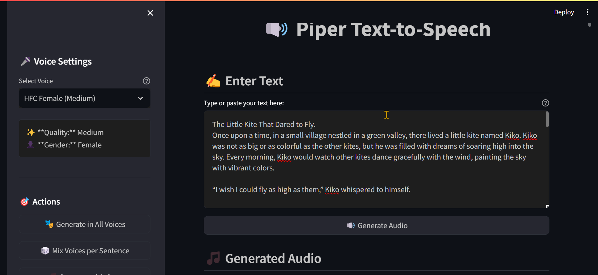

# Piper TTS Streamlit App

A Streamlit web application for text-to-speech conversion using Piper TTS. This app provides multiple ways to generate speech from text using different voices and styles.

⚠️ **IMPORTANT: This application is for personal and non-commercial use only.**



## Features

- **Multiple Voice Options**: Choose from various pre-trained voices
- **Multiple Generation Modes**:
  - Single Voice: Generate audio with one selected voice
  - All Voices: Generate the same text with all available voices
  - Mixed Voices: Generate each sentence with a different voice
  - Single Voice with Gaps: Generate sentences with 1-second gaps between them

## Disclaimer

This project is a wrapper application that uses several third-party technologies:
- **Piper TTS**: This project uses Piper TTS for speech synthesis but is not affiliated with or endorsed by the Piper TTS project.
- **Voice Models**: The voice models used in this application are third-party models. I do not own or claim any rights to these models.
- **Streamlit**: The UI is built using Streamlit framework.

All third-party components are subject to their respective licenses and terms of use. Users must comply with all applicable licenses and restrictions when using this application.

## Usage Restrictions

- This application is intended for **personal use only**
- **Not for commercial use**
- Users must comply with all third-party license terms
- No redistribution of voice models or generated audio for commercial purposes

## Prerequisites

- Python 3.7+
- Piper TTS installed with models
- Required Python packages:
  ```
  streamlit==1.29.0
  numpy==1.26.2
  scipy==1.11.4
  ```

## Installation

1. Clone this repository
2. Install the required packages:
   ```bash
   pip install -r requirements.txt
   ```
3. Make sure you have Piper TTS installed with models in `C:/piper/models/`

## Usage

1. Run the Streamlit app:
   ```bash
   streamlit run app.py
   ```

2. Enter your text in the text area

3. Choose one of the generation methods:
   - **Generate Audio**: Creates audio with selected voice
   - **Generate in All Voices**: Creates audio with all available voices
   - **Mix Voices per Sentence**: Uses different voices for each sentence
   - **Generate with Gaps**: Creates audio with 1-second gaps between sentences

## Voice Configuration

The app supports multiple voice models. Place your `.onnx` and `.onnx.json` files in the `C:/piper/models/` directory.

## Project Structure

```
tts_piper_simple/
├── app.py              # Main Streamlit application
├── requirements.txt    # Python dependencies
├── screenshot.png      # Application screenshot
└── README.md          # Documentation
```

## Contributing

Feel free to open issues or submit pull requests for improvements.

## License

This project's code is licensed under the MIT License. However:
- The application as a whole is for personal use only
- Third-party components (Piper TTS, voice models, etc.) are subject to their respective licenses
- Generated audio content is subject to the terms of use of the respective voice models

## Legal Notice

This project is not affiliated with, sponsored by, or endorsed by any of the third-party technologies used. All product names, logos, and brands are property of their respective owners. All company, product and service names used in this project are for identification purposes only. 